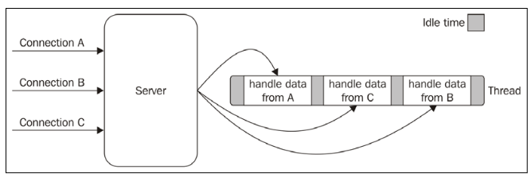

# Cómo trabaja NODE

> [!NOTE]
> Node tiene como filosofía la utilización de programas pequeños. Con interfaces pequeñas y simples

Se basa en tres conceptos:
- Patron reactor
- Arquitectura de un hilo
- non-blocking I/O

## I/O es lenta

Las operaciones `I/O` normalmente no son costosas en términos de CPU, pero la velocidad de acceso a la data es lo que agrega retraso a que se completen las operaciones.


- Acceso a RAM $10^{-9}$ segundos
- Acceso a data en el disco $10^{-3}$ segundos

Ancho de Banda:

- RAM tiene ancho del orden de los GB/s
- Disco o RED en el orden de los MB/s y de forma optimista GB/s


A eso podemos sumar que en ocasiones el input viene de humanos.

## Servidor Multihilo

La aproximación clásica en un servidor que bloquea `I/O` es usar multiples hilos


Lo imporante de el ejemplo anterior es:

- El tiempo de espera en cada hilo, mantiene tiempo de inactividad máquina que podrían usarse en otras cosas.

- Cualquier operación I/O, como una conexión a base de datos o filesystem, mantendrá el hilo bloqueado.

- Un hilo no es barato en términos de recursos del sistema.

## Servidor SingleThread

Si queremos acceder a información de `filesystem` o de un nodo de red, existen mecanismos en los sistemas operativos que permiten accesos llamados `non-blocking I/O`. Ests permite que la herramienta que hace llamados al sistema `systemcalls` pueda estar disponible inmediatamente después de ser invocados.

> [!TIP]
> Si quieres profundizar en esto puedes leer sobre `epoll` en sistemas Linux

### Bussy waiting

Un mecanismo para manejar la espera de resultados a una llamada a sistema es el `bussy waiting`. Que es un loop que consulta de manera recurrente cuando un recurso está disponible después de hacer una llamada a sistema.

```javascript
resources = [socketA, socketB, fileA]
// Los recursos pueden ser nodos de red (acceso una BD)
// Lectura de archivos en el equipo o servidores

while (!resources.isEmpty()) {
  for (resource of resources) {
    // intenta leer
    data = resource.read()
    if (data === NO_DATA_AVAILABLE) {
      // no hay data disponible
      continue
    }

    if (data === RESOURCE_CLOSED) {
      // el recurso se cierra 
      // se elimina de la lista de llamados
      resources.remove(i)
    } else {
      //se recibe data, la procesa
      consumeData(data)
    }
  }
}
```

> [!WARNING]
> Este método usa mucho recurso CPU sólo en esperar.

### Event demultiplexing

La mayoría  de los sistemas operativos ya tiene métodos nativos para esperar de manera `non-blocking` sin que se usen recursos como el caso de `bussy waiting`..

Este mecanismo se llama `synchronous event demultiplexer` o `event notification interface` (***interfaz de notificación de eventos*** o el ***demultiplexor de eventos sincrónico***)

> [!NOTE]
> En telecomunicaciones el **multiplexado** se refiere al mecanismo en que multiples señales se combinan en una, para que puedan ser transmitidas en un medio de capacidad limitada (Multiples dispositivos en nuestro hogar compartiendo el mismo cable de red)

> [!NOTE]
> El **demultiplexado** se refiere al evento contrario al multiplexado, para hacer uso de las señales.

En éste caso la interfaz de eventos `demultiplexor` observa multiples recursos y retorna un nuevo evento (o conjunto de eventos) cuando una operación `I/O` ejecutada sobre uno de esos recursos termina.

Este `demultiplexor` es sincrónico y se bloquea hasta que haya nuevos eventos para procesar.

Ejemplo del uso genérico de un `demultiplexor`

```javascript
watchedList.add(socketA, FOR_READ) // (1)
watchedList.add(fileB, FOR_READ) // (2)

while (events = demultiplexer.watch(watchedList)) {
  // event loop (loop de eventos)
  for (event of events) {
    // Esta lectura nunca se bloquea y siempre retornará data
    data = event.resource.read()

    if(data === RESOURCE_CLOSED) {
      // El recurso se ha cerrado, y se remueve de la lista de observados
      demultiplexer.unwatch(event.resource)
    } else {
      // Data ha sido recibida y se procesa
      consumeData(data)
    }

  }
}
```

Analicemos el pseudocódigo anterior:

1. Los recursos fueron añadidos a la estructura de datos, asociando cada uno de ellos a una operación específica (`READ` en el ejemplo)
2. El demultiplexor está configurado con el grupo de recursos a ser observados.
El llamado a `demultiplexer.watch()` es sincrónico y se bloquea hasta que cualquiera de cualquiera de los recursos está listo para `lectura` (`read`). Cuando ésto ocurre, el demultiplexer retorna un conjunto de eventos disponibles para procesar.
3. Cada evento retornado por el demultiplexor es procesado. En este punto, el recurso asociado con cada evento es listo para lectura y no ser bloqueado durante la operación. Cuando todos los eventos sean procesados, el flujo se bloqueará de nuevo en el demultiplexer hasta que nuevos eventos estén disponibles para ser procesados. Este es el **event loop**

Es interesante ver que éste patron ahora puede manejar multiples operaciones `I/O` dentro de un hilo, sin usar la técnica `busy-waiting`. Ahora con el uso del demultiplexor, usando sólo un hilo podemos lidear con muchos recursos.



se puede ver en la ilustración anterior que usando sólo un hilo se puede manejar múltiples operaciones `I/O` de manera concurrente. Las tareas son esparcidas en el tiempo, en vez de ser esparcidas en múltiples hilos y se minimiza el tiempo de espera.

Por otra parte, el patrón single-thead facilita la forma en que se entiende el desarrollo de apps por parte de los desarrolladores.

## Patron Reactor

Una especialización de los algoritmos anteriores es el patrón reactor. La idea principal del patrón reactor es tener un `handler` asociado a cada operación `I/O` (en nuestro caso es simplemente un callback)

Este callback se invocará apenas el evento se produzca y se procese por el event loop.


Esto ocurre cuando una APP usa el patrón reactor:

1. La aplicación genera una nueva operación `I/O` enviando una solicitud al `demultiplexer de eventos`. También especifica un handler, que será invocado cuando la operación `I/O` se complete. Enviar una nueva solicitud al `Event Demultiplexer` es una operación no bloqueante que retorna inmediatamente el control a la App.

2. Cuando un conjunto de operaciones `I/O` son completadas el `Event Demultiplexer` hace `push` de un conjunto eventos al `Event Queue` (lista de eventos)

3. En este punto, el `Event Loop` itera sobre los items del `Event Queue`.

4. Por cada evento, el `handler` (o `callback`) es invocado.

5. El handler, que es parte del código de la palicación, devuelve el control al `Event Loop` al completar su ejecución (**5a**). Mientras el handler se ejecuta, puede solicitar nuevas operaciones asíncronas (**5b**), causando que nuevos ítems se agreguen al `Event Demultiplexer (1)`

6. Cuando todos los items en el `Event Queue` son procesados, el `Event Loop` se bloquea en el `Event Demultiplexer` que activa otro ciclo cuando hay un nuevo evento disponible. 

> [!NOTE]
> Una aplicación **NodeJS** terminará cuando no existan operaciones pendientes en el `Event Demultiplexer`, y no queden eventos que procesar en el `Event Queue`

> [!NOTE]
> El patrón reactor maneja opearciones `I/O` mediante el bloqueo hasta que nuevos eventos están disponibles desde un conjunto de recursos observador, y luego reacciona mediante el envio de cada evento a un handler asociado

## Libuv, el motor `I/O` de Node.js

Cada sistema operativo tiene su propia interfáz del demultiplexor de eventos: `epoll` en linux, `kqueue` en mac y el API I/O Completition Port (`IOCP`) de Windows. Aparte de esto, cada operación I/O se comporta de maneras diferentes dependiendo del tipo de recurso, incluso dentro de los mismos OS. 

En el caso de Linux, el filesystem no soporta operacoines no-bloqueantes. Por lo que es necesario usar otro hilo fuera del event loop.

Es por ésto que el equipo de Node crea la librería `libuv` para estandarizar el manejo del OS por parte de node en los principales OS.

Aparte de abstraer las llamadas al SO, también provee el patrón reactor a las operaciones I/O, proveyendo un API para crear event loops, manejar el event queue, realizar operaciones asíncronas I/O y encolar otro tipo de tareas.

## La receta Node.js

El patrón reactor y `libuv` son los bloques constructivos bases de Node. 

A eso hay que sumar: 

- Bindings responsables de envolver y exponer libuv y otras funcionalidades low-level a JavaScript.
- El motor V8 para compilación de JS
- Una librería (nucleo)  que implemente el API de Node a un "alto nivel"


> [!NOTE]
> Cuando hablamos de aplicaciones y módulos userland, nos referimos a las que expuestas al usuario del sistema operativo
