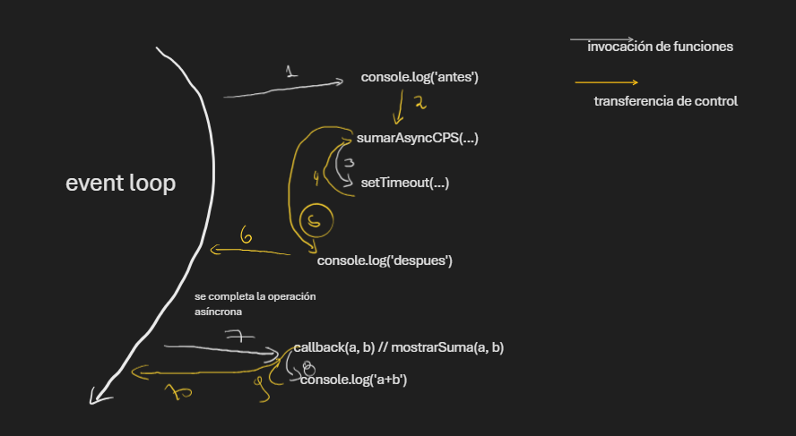
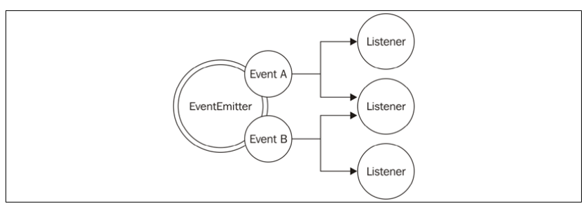

# Eventos y Callbacks Node

La programación sincrónica es simple de entender porque expresa una serie de acciones que se realizan una tras otra de manera secuencial. 

Cuando desarrollamos de forma asincrónica varias acciones son delegadas al sistema operativo o a otro elemento del entorno, por ejemplo lectura de un archivo, solicitud de red. Las cuales son llevadas a operaciones de "segundo plano"

Si ejecutamos una acción asíncrona, el codigo que sigue será ejecutado inmediatamente sin preocuparse de que la operación haya terminado.

Es por esto que se necesita un sistema de mensajes que notifique cuando una operación asincrónica termine.

En JS el mecanísmo más ampliamente usado es el `callback`, que es simplemente una función ejecutada con el resultado de una operación asíncrona.

Estos apuntes tendrán anotaciones sobre el patrón de Callback y el Patrón Observador, que son herramientas similares para manejar la asincronía en Node

## Patrón Callback

Los callbacks son una implementación de los handlers en el patrón reactor. Los callbacks son los que dan la impronta en en el desarrollo con Node.

Esto es facilitado en JavaScript debido a que las funciones son "ciudadanos de primera clase", donde éstas se pueden asignar a variables, ser pasadas como argumentos, definir de forma anónima y definir clousures, entre otros.


### Estilo "pasar a continuación" (Continuaion-passing style)

Un callback es una función que se pasa como argumento y se ejecuta cuando el resultado de una operación asincrónica está disponible. En programación funcional, la manera de propagar un resultado se llama **continuation-passing style** (**CPS**)

Este es un concepto general, no siempre asociado con asincronía, por lo que sólo indica que un resultado se propaga pasandolo a otra función, en vez de retornarlo directamente al invocador.

#### CPS Sincrónico

Veamos una función sincrónica que suma: 

```javascript
function mostrarSuma (a, b) {
  console.log(a + b)
}
```

Nada del otro mundo, el resultado se retorna al invocador usando `return`. (Recibe el nombre de **direct style**). Una función equivalente en **CPS** puede ser: 

```javascript
function sumarCPS (a, b, callback) {
  callback(a, b)
}
```

Donde `addCPS` es una función sincrónica: 

```javascript
console.log('antes')
sumarCPS(1, 2, mostrarSuma)
console.log('despues')
```

En éste caso la salida de consola es: 

```bash
antes
3
después
```

#### CPS Asincrónico

Si ahora cambiamos mostrar suma a un formato asincrónico:

```javascript
function sumarAsyncCPS(a, b, callback) {
  setTimeout(() => callback(a,b), 100)
}
```

```javascript
console.log('antes')
sumarAsyncCPS(1, 2, mostrarSuma)
console.log('despues')
```

Ahora la ejecución de "mostrarSuma" se delega al final de la cola de eventos

```bash
antes
después
3 # sumarAsyncCPS(1, 2, mostrarSuma)
```

Se puede entender lo ocurrido con el siguiente diagrama:



Al momento de invocar el programa ocurre de manera secuencial:

1. Del event loop se invoca `console.log('antes')`
2. se transfiere el control a `sumarAsyncCPS`
3. `sumarAsyncCPS` invoca `setTimeout`
4. Se retorna el control a sumarAsyncCPS
5. se transfiere el control a `console.log('despues')`
6. Se transfiere el control al event loop
7. Una vez lista la operación asincrónica se invoca `mostrarSuma` junto a la data
8. `mostrarSuma` invoca `console.log(a+b)` con la data correspondiente disponible
9. se transfiere el control desde `console.log(a+b)` a `mostrarSuma`
10. se transfiere el control desde `mostrarSuma` al event loop

> [!NOTE]
> El hecho que una función tenga aspecto de CPS no significa que sea asincrona
> ```javascript
>   const result = [1, 2, 3].map(number => number - 1);
>   console.log(result)
>  ```
> La función anterior es sincrónica

## Sincrónico o asincrónico

Es importante tener en cuenta que la ejecución de código sincrónico y asincrónico es radicalmente distinta y cambia el comportamiento de las aplicaciones. A continuación se presenta un caso donde la mezcla de código sincrónico y asincrónico puede llevar a inconsistencias y errores no previstos.

### API impredecible

Un caso problemático es definir un interfaz que sea sincrónica en unos casos y asincrónica en otros.

```javascript
import { readFile } from 'fs'

const cache = new Map()

function lectorInconsistente(filename, cb) {
  if (cache.has(filename)) {
    // función sincrónica
    cb(cache.get(filename))
  } else {
    // función asincrónica
    readFile(filename, 'utf8', (err, data) => {
      cache.set(filename, data)
      cb(data)
    })
  }
}
```


> [!WARNING]
> La forma propuesta para almacenar en caché información del archivo no es la óptima, pero sirve para ejemplificar el problema


La función anterior puede romper fácilmente una app de la forma en que fue definida.

```javascript
function crearLectorArchivos (filename) {
  const listeners = []

  lectorInconsistente(filename, valor => {
    listeners.forEach(listener => listener(valor))
  })

  return {
    onDataReady: listener => listeners.push(listener)
  }
}
```

Cuando la función anterior se ejecuta, crea un objeto que funciona como notificador, lo que nos permite configurar multiples listeners para una operación de lectura de archivos.

Todos los listeners se ejecutarán una vez cuando la operación de letctura termine y la data esté disponible.

La función anterior usa nuestro `lectorInconsistente` para implementar esta funcionalidad.

Usemos nuestra función `crearLectorArchivos()`:

```javascript
const lector1 = crearLectorArchivos('archivo.txt')

lector1.onDataReady(data => {
  console.log(`Primer listener con data: ${data}`)

  // Seguimos operando dentro de éste lector:
  // Después de un rato tratamos de leer nuevamente el mismo archivo.

  const lector2= crearLectorArchivos('archivo.txt')

  lector2.onDataReady(data => {
    console.log(`Segundo listener con data: ${data}`)
  })
})
```

Si vemos la salida de éste código por consola se notará lo siguiete (archivo `inconsistentFR.mjs`): 

```bash
$ node inconsistentFR.mjs 
Primer listener con data: Data en texto
```


- El código anterior, al usar `lector1`, se está invocando por primera vez el `archivo.txt`, por lo que lee este archivo de forma asíncrona y lo añade al caché. Eso implica que cualquier listener `onDataReady` se invocará en otro ciclo del event loop. Por lo que tenemos "tiempo de sobra" para que se registre nuestro listener.

- Cuando el lector2 es creado en un ciclo del event loop donde el caché pra el `archivo.txt` ya existe, la llamada interna para `lectorInconsistente` será sincrónica. Por lo que su callback (listener) será invocado inmediatamente, por lo tanto todos los listeners de `lector2` serán invocados de forma sincrónica. Sin embargo estamos registrando los listeners después de la creación de `lector2`, por lo que nunca podrán ser invocados

El comportamiento de los callbacks de nuestro `lectorInconsistente` es impredecible y depende de múltiples factores, como frecuencia de invocación, nombre de archivo pasado como argumento, tiempo que demora la carga.

Este bug es muy difícil de identificar y reproducir en una aplicación real.

## Patrón observador

El patrón observador es un complemento de los callbacks que permite modelar la naturaleza reactiva de Node.

> [!NOTE]
> El patrón observador define un objeco (llamado sujeto) que puede notificar un conjunto de observadores (o listeners) cuando ocurra un cambio de estado

La diferencia principal respecto al patrón callback es que el sujeto puede notificar multiples observadores, mientras que el patron CPS normalmente propaga su resultado a sólo un listener (callback)

## EventEmitter

En programación orientada a objetos "tradicionl", el patrón observador requiere multiples interfaces, clases concretas y jerarquias. En Node todo es más sencillo, El partrón observador ya viene dentro del nucleo a través de la clase `EventEmitter`.

La clase `EventEmitter` permite registrar una o múltiples funciones como listeners las cuales se invocarán cuando un evento particular se gatille.



El emisor de eventos se puede importar de la siguiente manera:

```javascript
import { EventEmitter } from 'node:events'

const emitter = new EventEmitter()
```

Los métodos escenciales son:

- `on(event, listener)`: Este metodo nos permite registrar un nuevo listener para un evento dado (string)

- `once(event, listener)`: Este evento registra un nuevo listener, que será removido después uqe el evento se emita por primera vez.

- `emit(event, [arg1], [...])`: El metodo produce un nuevo evento y provee argumentos adicionales que serán pasados a los listeners

- `removeListener(event, listener)`: Este método remueve un listener para el evento especificado.


> [!NOTE]
> Revisa el archivo eventos.mjs para ver cómo se genera una interfaz para eventos en Node.

> [!WARNING]
> El `EventEmitter` trata los errores de manera especial. De forma automática lanzará un error al sistema y saldrá de la aplicación si este error no tiene un listener asociado. 
> Por ésta razón se recomienda registrar un listener para el evento `error`

## Creando objetos observables

Raramente se usa el `EventEmitter` de forma aislada, como se vio en el ejemplo `eventos.mjs`.
Lo común es extender `EventEmitter` por otra clase, en la práctica esto permite que cualquier clase herede las capacidades de `EventEmitter`, por lo tanto convertirse en un objeto observable.

Para mirar esta implementación revisa el archivo `eventosClases.mjs`

## EventEmitter y memory leaks

Cuando hablamos de `memory leaks` nos referimos al defecto de software donde memoria que ya no es necesitada, no está siendo liberada, causando que el uso de memoria crezca indefinidamente.

En JavaScript en general la mayor parte de los `memory leaks` vienen de Listeners de eventos no liberados. 

Consideremos el siguiente código: 

```javascript
const estoUsaMemoria = 'un string muy grande ...'
const listener = () => {
  console.log(estoUsaMemoria)
}

emmiter.on('algun_evento', listener)
```

La variable `estoUsaMemoria` está referenciada por el listener, y por lo tanto su uso en memoria será retenido hasta que el `listener` sea liberado sel `emitter`, o hasta que el `emitter` sea recolectado por el `garbage collector`, que sólo puede ocurrir cuando no hay más referencias activas a él, haciendolo inalcanzable.

Entonces, si un `EventEmitter` permanece alcanzable durante toda la duración de la aplicación, todos sus listeners se mantendrán alcanzables, y junto con ellos, todas las referencias en memoria. 

En una aplicación servidora que tuviese registrado de manera "permanente" un `EventEmitter` para cada solicitud HTTP que reciba el computador, entonces causaríamos un memory leak.
La memoria usada por la aplicación crecería indefinidamente dependiendo del uso de la aplicación, hasta eventualmente fallar.

Para prevenir la situación, se puede liberar el `listener` con el método `removeListener()` del `EventEmitter`
