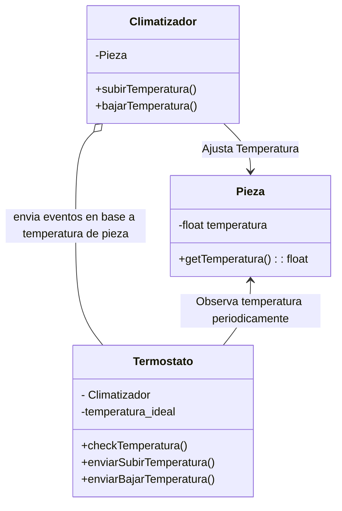

# IoT

Imagina que tienes una serie de sensores con los cuales puedes controla tu hogar.



Estos sensores trabajan de manera asincrona, usando callbacks, promesas y/o eventos.


También tienes algunos objetos JS que simulan el comportamiento de tu hogar

```javascript
class Pieza {
  constructor() {
    /**
     * Por conveniencia parte en ésta temperatura
     */
    this.temperatura = 30.1;

    /**
     * Cada 10 segundos sube o baja la temperatura 
     * de manera aleatoria hasta +/- un grado
     */

    setInterval(() => {
      this.temperatura += Math.random() * 2 -1

      console.log(`Cambio aleatoreo de temperatura a ${this.temperatura.toFixed(1)}°C`)
    }, 10000)
  }
}
```

Con la finalidad de controlar de manera automatizada la temperatura de la pieza, deberás crear un climatizador que tenga la siguiente interfaz:

1. Acepta en el constructor un objeto de tipo `Pieza`
2. Debe tener un método para enfriar la temperatura de la `Pieza`
3. Debe tener un método para aumentar la temperatura de la `pieza`

También deberás implementar la clase Termostato. 

1. Acepta un `Climatizador` en el constructor
2. Analiza de forma periodica la temperatura de la `pieza`
3. Según la diferencia de temperatura ideal y temperatura de la pieza emite eventos indicando si la hace "mucho_calor" o "mucho_frio".